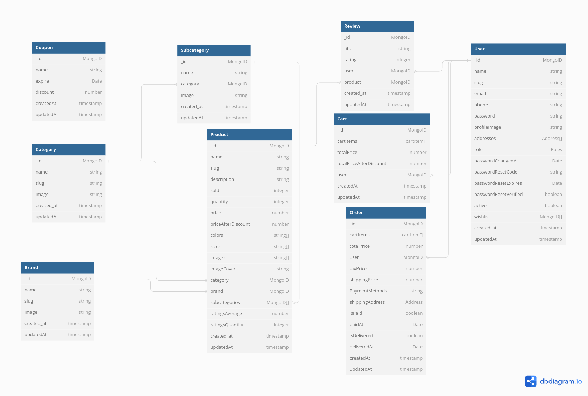

# Express E-commerce Api
An E-commerce Restful API built using Express Framework with MongoDB.

# Basic Features 
- Advance searching, sorting, pagination and filtering.
- View categories,subcategories,brands and products.
- Login & Register Users - JWT Authentication.
- Custom permissions set for necessary endpoints.
- Password forgot/reset, confirmation email. 
- Image Upload and image processing.
- Add to cart & wishlist.
- Discount coupon code.
- Star rating system.
- Credit card payment with stripe.
- Cash on delivery.

# Technologies & Packagees
Built with a bunch of things, but to name a few:
- [Express](https://expressjs.com/) 
- [TypeScript](https://www.typescriptlang.org/)
- [Mongoose](https://mongoosejs.com/)
- [Nodemailer](https://nodemailer.com/)
- [Multer](https://github.com/expressjs/multer)
- [JWT](https://jwt.io/)
- [Sharp](https://sharp.pixelplumbing.com/)
- [Stripe](https://stripe.com/)

# ERD Digram 


# Configurations
After clonning the repo you need to create .env file
```bash
cd e-commerce-wep-api
touch .env
```
## MongoDB
- You need to create a Database, my choice here was to create account on [atlas](https://www.mongodb.com/atlas/database) for cloud database service. 
- in .env file :
```bash
PORT = XXXX
NODE_ENV = development | test | production
MONGO_URI = mongodb+srv://<username>:<password>@cluster0.t8sswhx.mongodb.net/<databaseName>?retryWrites=true&w=majority
BASE_URL = <webiste_url>
```
## Brevo
- Brevo is great choice for development apps as they offer a great free tier of 300 emails per day, it is very easy to setup and I followed this guide [here](https://www.programonaut.com/how-to-send-an-email-in-node-js-using-an-smtp-step-by-step/)
- in .env file:
```bash
EMAIL_HOST = smtp-relay.brevo.com
EMAIL_PORT = 587 
EMAIL_USER = <Your email in brevo website>
EMAIL_PASSWORD = <STMP Key>
```
## Stripe
- We need a payment gateway for Credit card payment and stripe one of the best choices here, you need to create account there.
- in .env file: 
```bash
STRIPE_SECRET_KEY = <Your Strip Key>
STRIPE_WEBHOOK_SECRET = <Webhook Secret>
```

# Installation
```bash
npm install
```

# Building
```bash
npm run dev
```


